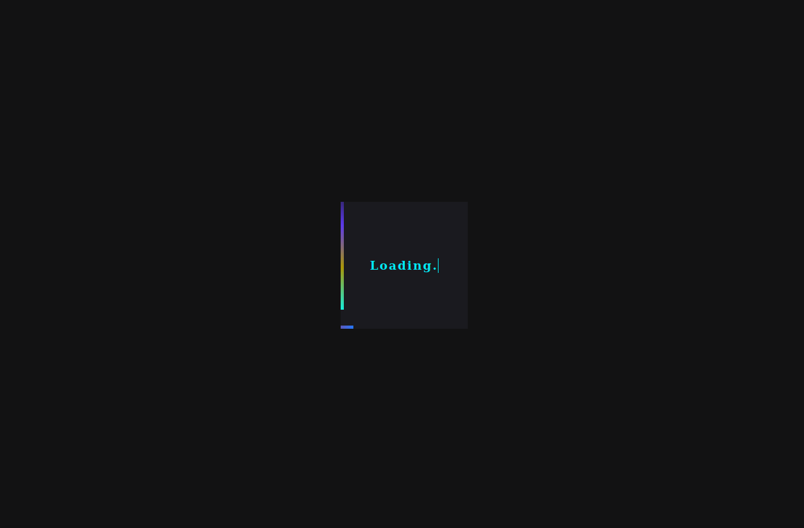
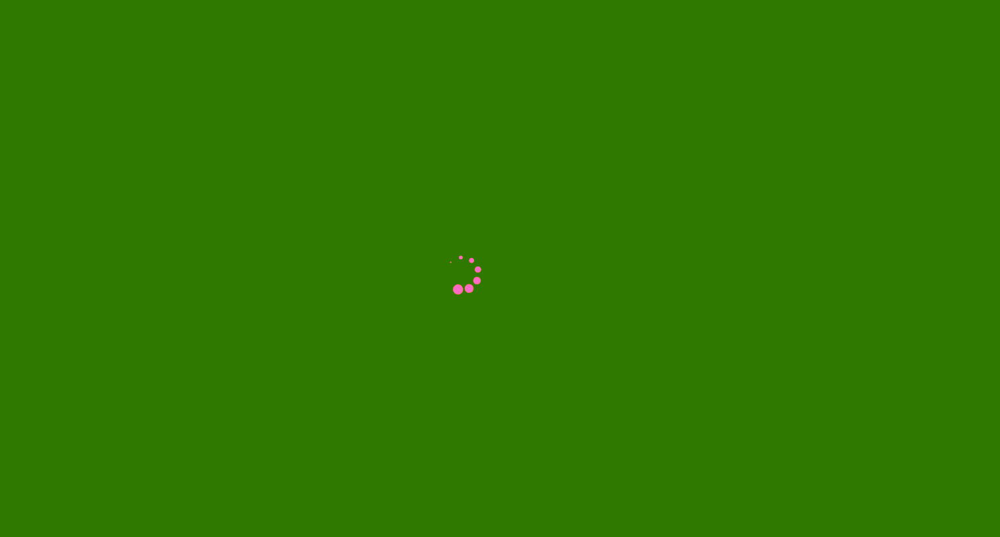
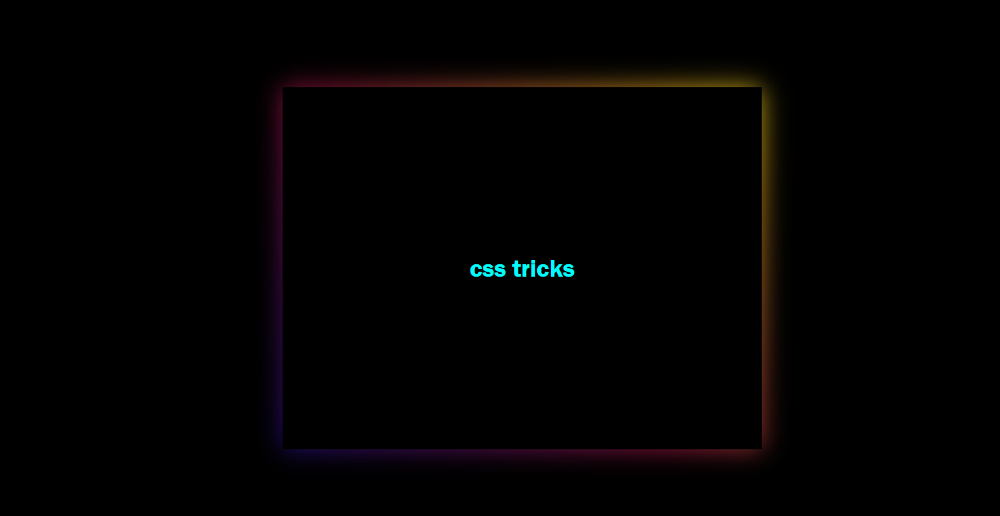
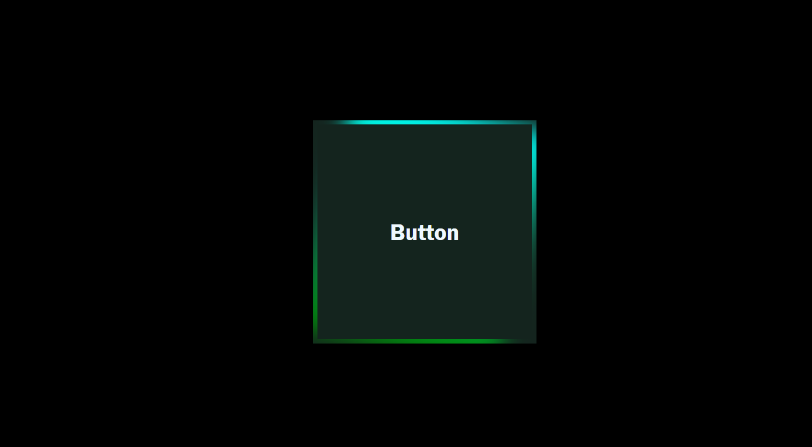

# csstricks
<h4>What's up guys i came with new and awesome css ideas😍</h4>
&nbsp;This is a fun project that I have developed with help of some of my friends.
&nbsp;This project has a tonne of ideas you can use to develop good gui interfaces.
<h3>Let's look at the preview of some awesome projects.</h3>
<h2>Box loader.</h2>

<h2>Loading.</h2>

<h2>Shining borders.</h2>

<h2>Button.</h2>

<h4>This is a companied by more and more css tricks.</h4>
<h2>I want to thank all my friends and followers for the support you have been giving me from the start👏.</h2>

All rights reserved,this is a copyright software ©

